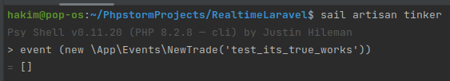
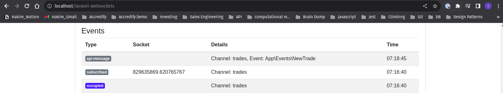
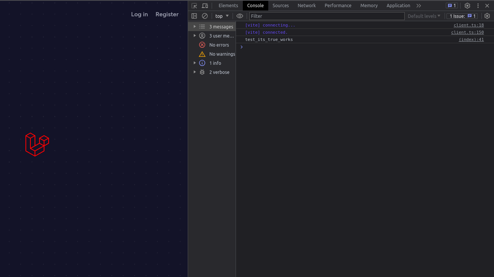

# Laravel Websocket Vite Sail

## 1. Laravel side 

### Pre-requisites
- laravel sail is up!

Publish laravel sail 
```
//set .env
cp .env.example .env

//need to access supervisord.conf later on
sail artisan sail publish
```

Publish websocket files
```
sail artisan vendor:publish --provider="BeyondCode\LaravelWebSockets\WebSocketsServiceProvider" --tag="migrations"
```

Run migrations
```
sail artisan migrate
```

Change .env
```
//.env

BROADCAST_DRIVER=pusher
...
PUSHER_APP_ID=12345
PUSHER_APP_KEY=12345
PUSHER_APP_SECRET=12345

```

Change configs
```
//config/app.php
uncomment
//App\Providers\BroadcastServiceProvider::class,

______________________________________________

//configs/broadcasting.php
//local test so idgaf about tls or encrypted
...
        'pusher' => [
            'driver' => 'pusher',
            'key' => env('PUSHER_APP_KEY'),
            'secret' => env('PUSHER_APP_SECRET'),
            'app_id' => env('PUSHER_APP_ID'),
            'options' => [
                'cluster' => env('PUSHER_APP_CLUSTER'),
                // 'encrypted' => true,
                'host' => '127.0.0.1',
                'port' => 6001,
                'scheme' => 'http'
            ],
        ],
...
```

Modify Dockerfile
```
//docker/8.2/supervisord.conf
//ensure websocket automatically start when we run container

...
[program:websockets]
command=/usr/bin/php /var/www/html/artisan websockets:serve
numprocs=1
autostart=true
autorestart=true
user=sail
...
______________________________________________

//docker-compose.yml
...
        ports:
            - '${APP_PORT:-80}:80'
            - '${VITE_PORT:-5173}:${VITE_PORT:-5173}'
            - '${LARAVEL_WEBSOCKETS_PORT:-6001}:6001'
...
```

monitor on websockets-laravel
```
// on browser access

localhost/laravel-websockets
```

## 2. Browser side

```
1. uncomment Echo relevant code in boostrap.js

2.Add Echo to view 
// welcome.blade.php
...
@vite('resources/js/app.js')
...
    <script type="module"> // somehow type="module" is needed as it ensure script runs before mounted. 
        Echo.channel('trades')
            .listen('NewTrade', (e) => {
                console.log(e.trade);
            })
    </script>
...

3.Serve the application, Fe need to subscribe to channel. 
npm run dev
```


## 3. Test it out!

```
1. If you look at this code, i've already created an event which is broadcasted on 'trades' channel.

2. Trigger this event in tinker
//terminal
sail artisan tinker
event (new \App\Events\NewTrade('test'))

3. inspect and look at browser console at localhost.

4. check for event againt localhost/laravel-websockets

```

## 4. Proof






